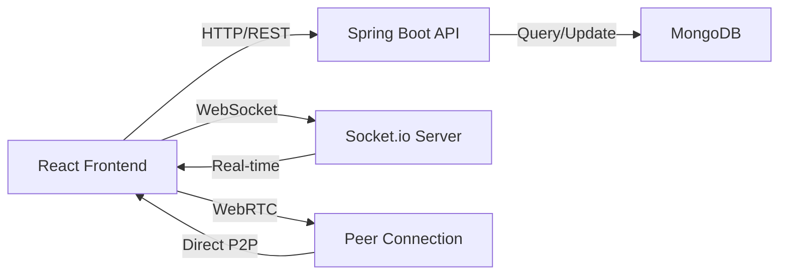
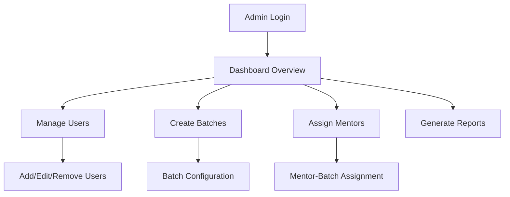
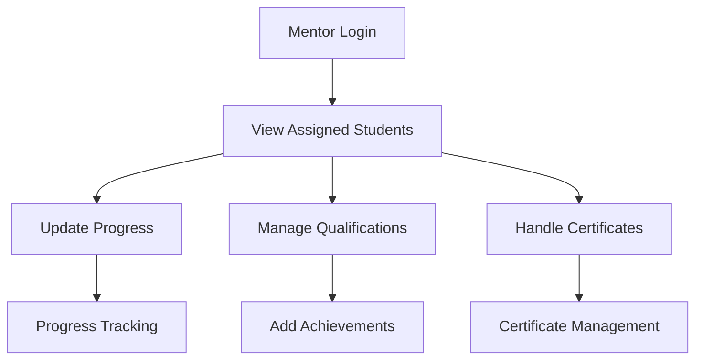

# 🚀 MenteeConnect

<div align="center">
  
  
  
  
</div>

<div align="center">
  <h3>🎯 Streamlined mentor-student management platform</h3>
  <p><em>A comprehensive web application that simplifies academic mentorship through intuitive batch management, progress tracking, and role-based access control.</em></p>
</div>

---

## ✨ What Makes MenteeConnect Special

**MenteeConnect** is a robust mentorship management system built for educational institutions and training organizations:

- 👥 **Multi-role System** with Admin, Mentor, and Student access levels
- 🎓 **Batch Management** for organized student grouping
- 📊 **Progress Tracking** with qualifications and certificates
- 🔐 **Secure Authentication** with JWT and Spring Security
- 📱 **Modern React UI** with Tailwind CSS and responsive design
- 🎥 **Real-time Video Calls** with WebRTC integration
- 💬 **Live Communication** via Socket.io
- ⚡ **Fast Performance** with MongoDB and optimized queries

## 🎭 User Roles & Capabilities

### 🛡️ **Admin Dashboard**
*Complete system control and oversight*
- ➕ **User Management** - Add, edit, remove mentors and students
- 🎓 **Batch Operations** - Create batches and assign mentors
- 📊 **System Analytics** - View platform-wide performance metrics
- 📋 **Report Generation** - Generate comprehensive performance reports
- 🔧 **Account Management** - Manage user roles and permissions

### 👨‍🏫 **Mentor Portal** 
*Focused tools for student guidance*
- 📚 **Student Overview** - View complete list of assigned students
- 📈 **Progress Updates** - Track and update student academic progress
- 🏆 **Qualification Management** - Add/update student achievements
- 📜 **Certificate Handling** - Manage student certifications
- 👤 **Profile Management** - Update personal mentor information
- 🎯 **Batch Insights** - Access detailed batch performance data

### 🎓 **Student Interface**
*Personalized learning experience*
- 👤 **Personal Dashboard** - View complete personal profile
- 👨‍🏫 **Mentor Details** - Access assigned mentor information  
- 📊 **Academic Progress** - Track learning journey and achievements
- 🏆 **Certificates & Qualifications** - View earned credentials
- 🎓 **Batch Information** - Access batch details and peers
- ✏️ **Profile Updates** - Manage personal information

## 🛠️ Technology Stack

### Frontend Powerhouse
```javascript
⚛️ React 18+          // Modern component-based architecture
🎨 Tailwind CSS       // Utility-first styling framework
🔄 React Router v6    // Client-side routing & navigation
📡 Socket.io Client   // Real-time WebSocket communication
🎥 WebRTC            // Peer-to-peer video/audio streaming
📋 React Hook Form   // Elegant form handling & validation
🌐 Axios             // HTTP client for API requests
📅 date-fns          // Modern date/time utilities
🎭 Hero Icons        // Beautiful SVG icon library
```

### Backend Architecture
```java
☕ Java 17+           // Modern JVM with latest features
🍃 Spring Boot 3+     // Production-ready framework
🔒 Spring Security    // Comprehensive security framework
🍃 Spring Data MongoDB // Elegant database integration
🔐 JWT Authentication // Stateless security tokens
📡 WebSocket Support  // Real-time bidirectional communication
```

### Database & Infrastructure
```javascript
🍃 MongoDB 4.4+      // NoSQL document database
🔧 Maven             // Backend dependency management
📦 npm/yarn          // Frontend package management
📚 Swagger/OpenAPI   // API documentation
🌿 MongoDB Compass   // Database management GUI
```

## 🚀 Quick Start Guide

### Prerequisites
Make sure you have these installed:
- ☕ **Java 17+** 
- 🍃 **MongoDB 4.4+** (running on default port)
- 🔧 **Maven 3.6+**
- 🌐 Modern web browser

### Lightning Setup ⚡

```bash
# Clone the repository
git clone https://github.com/coder-mahi/Mentee_Connect.git
cd Mentee_Connect

# Backend Setup
cd backend
mvn clean install
mvn spring-boot:run

# Frontend Setup (new terminal)
cd ../frontend
npm install
npm start

# Start MongoDB (if not running)
mongod
```

**🎉 Backend API: `http://localhost:8080`**  
**🎉 Frontend App: `http://localhost:3000`**

### Default Login Credentials
```
Admin:   admin@menteeconnect.com / admin123
Mentor:  mentor@menteeconnect.com / mentor123  
Student: student@menteeconnect.com / student123
```

## 🌟 Core Features Deep Dive

<table>
<tr>
<td width="50%">

### 🎥 **Real-time Communication**
- **Video Conferencing** - WebRTC peer-to-peer calls
- **Live Chat** - Socket.io instant messaging
- **Screen Sharing** - Present and collaborate live
- **Audio Controls** - Mute/unmute functionality
- **Meeting Management** - Start/join/end sessions
- **Connection Quality** - Adaptive streaming

</td>
<td width="50%">

### 📊 **Modern React Experience**
- **Component Architecture** - Reusable UI components
- **State Management** - Context API & React hooks
- **Form Validation** - React Hook Form + Yup
- **Responsive Design** - Tailwind CSS utilities
- **Route Protection** - Secure navigation
- **Performance Optimized** - Code splitting & lazy loading

</td>
</tr>
</table>

## 🏗️ System Architecture

### Full-Stack Architecture
```
📁 MenteeConnect/
├── 🎨 frontend/                # React Application
│   ├── src/
│   │   ├── components/         # Reusable UI components
│   │   │   ├── common/         # Shared components
│   │   │   ├── forms/          # Form components
│   │   │   └── video/          # Video call components
│   │   ├── pages/              # Route-based pages
│   │   │   ├── admin/          # Admin dashboard
│   │   │   ├── mentor/         # Mentor portal
│   │   │   └── student/        # Student interface
│   │   ├── hooks/              # Custom React hooks
│   │   ├── context/            # React Context providers
│   │   ├── services/           # API integration
│   │   └── utils/              # Helper functions
│   ├── public/                 # Static assets
│   └── package.json            # Dependencies
└── ⚙️ backend/                 # Spring Boot API
    ├── src/main/java/
    │   ├── controllers/        # REST endpoints
    │   ├── services/           # Business logic
    │   ├── models/             # Data entities
    │   ├── repositories/       # Data access layer
    │   └── security/           # Security configuration
    └── pom.xml                 # Maven dependencies
```

### Communication Flow


## 📈 Key Workflows

### Admin Workflow


### Mentor Workflow  


## 🔧 Configuration

### Database Configuration
```yaml
# application.yml
spring:
  data:
    mongodb:
      uri: mongodb://localhost:27017/menteeconnect
      database: menteeconnect
```

### Security Configuration
```yaml
jwt:
  secret: your-secret-key
  expiration: 86400000 # 24 hours
```

## 🚀 Deployment Options

### Cloud Platforms
- ☁️ **AWS** - EC2, ECS, or Elastic Beanstalk
- 🚀 **Heroku** - Easy Git-based deployment
- 🚄 **Railway** - Modern deployment platform
- 🌐 **DigitalOcean** - App Platform or Droplets

### Docker Deployment
```dockerfile
FROM openjdk:17-jdk-slim
COPY target/menteeconnect.jar app.jar
EXPOSE 8080
ENTRYPOINT ["java", "-jar", "/app.jar"]
```

## 🤝 Contributing

We welcome contributions! Here's how to get started:

1. **Fork** the repository
2. **Create** a feature branch (`git checkout -b feature/NewFeature`)
3. **Commit** changes (`git commit -m 'Add NewFeature'`)
4. **Push** to branch (`git push origin feature/NewFeature`)  
5. **Open** a Pull Request

### Development Guidelines
- Follow Java coding conventions
- Write unit tests for new features
- Update documentation as needed
- Ensure responsive design compatibility

## 🛣️ Roadmap

### 🎯 Immediate Goals
- [ ] 📧 Email notification system
- [ ] 📊 Advanced analytics dashboard  
- [ ] 📱 Mobile app development (React Native)
- [ ] 🔔 Push notifications
- [ ] 🤖 AI-powered mentor matching

### 🔮 Future Enhancements
- [ ] 🎮 Gamification features
- [ ] 📈 Machine learning insights
- [ ] 🌍 Multi-language support
- [ ] 📅 Advanced scheduling system
- [ ] 🔍 Advanced search and filtering
- [ ] 📊 Real-time collaboration tools

## 📊 System Requirements

### Minimum Requirements
- **Java**: 17 or higher
- **Node.js**: 16+ with npm/yarn
- **MongoDB**: 4.4+  
- **RAM**: 4GB minimum
- **Storage**: 2GB available space
- **Network**: Stable internet for video calls

### Recommended Specifications
- **Java**: Latest LTS version
- **Node.js**: Latest LTS version
- **MongoDB**: Latest stable version
- **RAM**: 8GB or higher
- **Storage**: 10GB+ available space
- **CPU**: Multi-core processor
- **Network**: High-speed broadband

## 📄 License

This project is licensed under the MIT License - see the [LICENSE](LICENSE) file for details.

## 🙏 Acknowledgments

Special thanks to:
- ⚛️ **React Team** for the incredible frontend framework
- 🍃 **Spring Team** for the amazing backend framework
- 🍃 **MongoDB** for flexible database solutions  
- 🎨 **Tailwind CSS** for utility-first styling
- 🔄 **Socket.io** for real-time communication
- 👥 **Open Source Community** for continuous inspiration

---

<div align="center">
  <h3>🌟 Built with ❤️ for educational excellence</h3>
  <p>
    <strong>MenteeConnect</strong> - Empowering education through technology
  </p>
  <p>
    <a href="#-menteeconnect">⬆️ Back to top</a> •
    <a href="https://github.com/coder-mahi/Mentee_Connect/issues">🐛 Report Bug</a> •
    <a href="https://github.com/coder-mahi/Mentee_Connect/issues">✨ Request Feature</a>
  </p>
</div>
